# Vyapari Architecture & System Design Specification
## *Autonomous Intelligence for High-Performance Retail Operations*

> [!IMPORTANT]
> This document serves as the absolute source of truth for the technical architecture, data models, AI pipelines, and design paradigms of the **Vyapari** retail intelligence platform. All future development, refactoring, and integration efforts must strictly conform to the specifications detailed herein.

---

## 1. System Topology & Architectural Overview

Vyapari is a high-performance, multi-tenant retail intelligence platform designed to elevate standard inventory and transaction data into predictive strategic plans. The system is engineered around a decoupled, service-oriented architecture connecting a high-speed Brutalist front-end with a serverless Postgres backend (Supabase) and real-time AI middleware.

```mermaid
graph TD
    %% Frontend Client Layer
    subgraph Client ["Client Layer (React 19 + Vite + Tailwind 4)"]
        UI["Dashboard & Command Center (Premium Brutalist UI)"]
        VANI_UI["VANI Voice Console (STT/TTS)"]
        SimLab["Simulation Lab (What-If Engine)"]
        Heatmap["3D Inventory Heatmap (Three.js)"]
        RBAC["RBAC & Role Guard Layer"]
        BiometricShield["BiometricShield (WebAuthn UI)"]
        LiquidInvoiceAction["LiquidInvoiceAction (Early Settlement)"]
        MeshInbox["MeshInbox (Collaborative P2P Sync)"]
        VisualVerification["VisualVerification (vPOD Camera)"]
        SmartDunning["SmartDunning (Sentiment-Aware Recovery)"]
        ITCShield["ITCShield (GST Compliance UI)"]
        FraudGuard["FraudGuard (Margin/Drift Monitoring)"]
        MarketSimulator["MarketSimulator ( Monte Carlo Slider UI )"]
    end

    %% State & Service Orchestration Layer
    subgraph Services ["State & Service Orchestration Layer"]
        Auth["AuthContext (Business Scoping)"]
        Data["DataContext (Tiered Loader)"]
        RT["Postgres Realtime Subscriptions"]
        NeuralBus["Neural Event Bus"]
        biometricService["biometricService.ts (WebAuthn Logic)"]
        settlementEngine["settlementEngine.ts (Liquid Invoice calculations)"]
        meshService["meshService.ts (P2P Handshake & Hybrid Resolution)"]
        procurementService["procurementService.ts (Auto-Replenish Agent)"]
        disputeGuardService["disputeGuardService.ts (Conflict Scorer)"]
        fraudGuardService["fraudGuardService.ts (Margin & Cost Anomaly Monitor)"]
        itcShieldService["itcShieldService.ts (Fuzzy GSTR-2B Matching)"]
    end

    %% Cloud Infrastructure Layer
    subgraph Cloud ["Supabase Cloud Infrastructure"]
        DB[(PostgreSQL Database)]
        RLS["Row-Level Security (RLS)"]
        Storage["Supabase Storage (Invoice PDFs)"]
        Functions["Supabase Edge Functions (VANI Brain, OCR, WhatsApp)"]
        invoice_payment_splits["invoice_payment_splits Table"]
        credit_notes["credit_notes Table"]
        peer_drafts["peer_drafts Table (Extended Dispute Buffer)"]
        invoices["invoices Table (Extended Agency Fields)"]
    end

    %% AI Core Layer
    subgraph AI ["AI Brain Core (Gemini 2.5 Flash / 1.5 Pro)"]
        VaniBrain["vani-brain (Intent Resolver)"]
        DssAI["dss-ai (Strategy Orchestrator)"]
        OcrService["ocr-service (Document Intel)"]
        ProcureAI["agentic-procurement (Auto-Reorder)"]
        InvIntel["inventory-intelligence (Predictive Stock)"]
        DunningGen["dunning-generator (Debt Recovery)"]
        AutoRecon["auto-reconciliation (Payment Matcher)"]
        RiskBlocker["predictive-risk (Credit Guard)"]
    end

    %% Visual Relationships
    UI --> Auth
    Auth --> RLS
    RLS --> DB
    DB --> RLS
    DB --> RT
    RT --> Data
    Data --> UI
    Heatmap --> Data
    DB --> Data
    DB --> DssAI
    DssAI --> DB
    DB --> InvIntel
    InvIntel --> DB
    DB --> AutoRecon
    AutoRecon --> DB
    DB --> RiskBlocker
    RiskBlocker --> UI
    DB --> OcrService
    OcrService --> DB
    DunningGen --> DB
    Functions --> DB
    Functions --> Storage
    
    %% New Service & Component Mappings
    BiometricShield --> biometricService
    biometricService --> DB
    LiquidInvoiceAction --> settlementEngine
    settlementEngine --> invoices
    MeshInbox --> meshService
    meshService --> peer_drafts
    meshService --> credit_notes
    VisualVerification --> DB
    SmartDunning --> Data
    ITCShield --> itcShieldService
    itcShieldService --> DB
    FraudGuard --> fraudGuardService
    fraudGuardService --> DB
    MarketSimulator --> DssAI
    
    %% DB Relations
    invoices --> invoice_payment_splits
    peer_drafts --> credit_notes
```



---

## 2. Modern Executive Frontend Architecture & Core Stack

The frontend is built on **React 19** and compiled via **Vite**. The UI implements a custom **"Modern Executive" Design System**, utilizing premium typography (Outfit, Space Grotesk), glassmorphic elevations, and a sophisticated indigo-neon palette over a subtle grid-based neural background.

### 2.1 Core Component Architecture Mapping
All front-end components are modularly isolated inside `src/components`:
- **`3d/InventoryHeatmap.tsx`**: Uses `@react-three/fiber` to render an interactive 3D box heatmap displaying stock volumes and velocity.
- **`VANI/VANI.tsx`**: Floating console capturing user audio, routing text inputs to the `vani-brain` engine.
- **`dashboard/Dashboard.tsx`**: The main "Executive War Room" dashboard, using **Neural Pulse** micro-animations and high-density KPI ribbons.
- **`inventory/ProductInsights.tsx`**: High-fidelity detail view for individual products, showing historical price trends and velocity metrics.
- **`contacts/CustomerDetail.tsx`**: Analytical dashboard for customer behavior, including CLV (Customer Lifetime Value) and RFM scores.
- **`dss/SimulationEngine.tsx`**: The core of the **Simulation Lab**, allowing users to run "What-If" scenarios on pricing and market conditions.
- **`banker/BankerStrategicView.tsx`**: Specialized module for institutional credit readiness, visualizing debt-to-equity and cash flow waterfalls.
- **`common/RoleGuard.tsx`**: Enforces Role-Based Access Control (RBAC) across sensitive modules (e.g., Banker's View restricted to Owners/Bankers).

### 2.2 Advanced Intelligence & Automation Components
- **`auth/BiometricShield.tsx`**: Cryptographic identity verification modal window using hardware-level biometrics (WebAuthn) for sensitive ledger overrides and bankers transactions.
- **`invoices/LiquidInvoiceAction.tsx`**: Generates and broadcasts dynamic early-payment discounts computed via time-decay parameters.
- **`invoices/MeshInbox.tsx`**: Unified incoming peer ledger draft inbox with controls for partial acceptance, credit note generation, and tax escrow hold.
- **`inventory/VisualVerification.tsx`**: Camera scanner station using computer vision (vPOD) to confirm the integrity of incoming deliveries against purchase orders.
- **`automation/SmartDunning.tsx`**: Customer sentiment-aware dunning message lab that auto-drafts optimized recovery reminders for WhatsApp.
- **`compliance/ITCShield.tsx`**: Neural reconciliation dashboard displaying perfect matches, mismatches, and GSTR-2B discrepancy logs.
- **`analytics/FraudGuard.tsx`**: High-visibility active anomaly tracking panel displaying product margins and vendor cost drifts.
- **`analytics/MarketSimulator.tsx`**: Interactive slider board for running what-if scenarios on margins and demand variations.

### 2.3 Styling System (Tailwind CSS 4.0 & Custom CSS)
Vyapari uses **Tailwind CSS 4.0** with deep theme configurations. Theme variables are declared using `@theme` syntax to achieve a premium executive feel:
```css
@theme {
  --color-ink: #0F172A;      /* Deep Slate */
  --color-neon: #9FEF00;     /* Kinetic Neon Lime */
  --color-brand: #4F46E5;    /* Executive Indigo */
  --color-neural: #6366F1;   /* Soft Neural Indigo */
  --color-glass: rgba(255, 255, 255, 0.4);
}
```

---

## 3. State Orchestration & Tiered Loading Strategy

To handle enterprise-grade datasets without UI lag, Vyapari implements a **Dual-Tier Loading Strategy** governed by `DataContext.tsx`.

1. **Priority Tier (Initial Load)**:
   - `products`, `invoices`, `contacts`, `categories`.
2. **Deferred Tier (+5s)**:
   - `ledger_entries`, `audit_logs`, `stock_movements`.

### 3.1 Neural Event Bus
The platform utilizes a custom event-driven architecture where AI-driven insights (e.g., a "Critical Stockout" predicted by the AI) are broadcast via the **Neural Event Bus**. This allows UI components to react to background AI processes without polling.

---

## 4. Normalized Postgres Database Schema & Migration Layers

The platform leverages a Postgres schema with Row-Level Security (RLS) to enforce absolute multi-tenant isolation. Recent migrations extend the database to support advanced B2B coordination, dispute settlement, and compliance.

### 4.1 Core Schema Additions
- **`invoice_payment_splits`**: Stores micro-installment records generated when `split_installments` is selected as the preferred settlement path.
- **`credit_notes`**: Records ledger credit balances generated from partial peer draft acceptances to offset future B2B trade debts.
- **`gstr2b_records`**: Captures GSTR-2B compliance data imported from the tax portal for neural reconciliation matching.
- **`settlement_transactions`**: Logs the details of dynamic early settlement offers, including baseline limits, active discounts, and expiry metrics.

### 4.2 Invoice Table Extension Fields
- `preferred_settlement` (`settlement_path` ENUM: `standard`, `liquid_discount`, `factored_bank`, `split_installments`, `debt_endorsement`).
- `factoring_partner_id`: UUID reference for banks funding receivables.
- `installment_intervals`: Number of split payment intervals (defaults to 1).
- `endorsed_to_business_id`: UUID reference of the supplier receiving an endorsed invoice.
- `risk_markup_percentage` & `risk_premium_amount`: Strategic markups calculated from dispute risks.
- `secure_escrow_hold`: Boolean indicating that the tax portion is held back.
- `itc_status` (`itc_compliance_status` ENUM: `unverified`, `matched`, `mismatched`, `held_escrow`).
- `tax_escrow_held_amount` & `gstr_2b_matching_id`.

### 4.3 Database Intelligence (PL/pgSQL triggers)
- **`auto_generate_payment_splits()`**: An active table trigger executing after insertions or updates on `invoices`. If `split_installments` is selected with intervals greater than 1, it automatically creates weekly micro-installment records:
```sql
CREATE OR REPLACE FUNCTION auto_generate_payment_splits()
RETURNS TRIGGER AS $$
DECLARE
    v_split_amount NUMERIC;
    v_counter INTEGER := 1;
    v_due_date TIMESTAMP WITH TIME ZONE;
BEGIN
    IF NEW.preferred_settlement = 'split_installments' AND NEW.installment_intervals > 1 THEN
        v_split_amount := NEW.total / NEW.installment_intervals;
        DELETE FROM invoice_payment_splits WHERE invoice_id = NEW.id;
        WHILE v_counter <= NEW.installment_intervals LOOP
            v_due_date := NEW.created_at + (v_counter * INTERVAL '7 days');
            INSERT INTO invoice_payment_splits (invoice_id, split_number, due_date, amount, status)
            VALUES (NEW.id, v_counter, v_due_date, v_split_amount, 'unpaid');
            v_counter := v_counter + 1;
        END LOOP;
    END IF;
    RETURN NEW;
END;
$$ LANGUAGE plpgsql;
```

- **`apply_liquid_settlement()`**: Safely processes early payment discounts, locking rows with `FOR UPDATE`, computing pressure coefficients based on business health metrics, adjusting invoice totals, and writing records to audit ledgers.

---

## 5. Decision Support System (DSS) Core Engines

The **Decision Support System (DSS)** orchestrates multiple mathematical and heuristic models:

1. **Pricing Engine**: Analyzes Price Elasticity ($\epsilon$) to recommend margin optimizations.
2. **RFM Clustering**: Groups customers into segments like `Whales`, `At-Risk`, or `Churn Risk`.
3. **Forecast Engine**: Uses time-series analysis to project cash flow and revenue for the next 30/60/90 days.
4. **Replenishment Engine**: Calculates reorder points based on real-world stock velocity, not just static levels.
5. **Churn Prediction**: Identifies customers likely to stop buying based on transaction interval deviations.
6. **Market Share Simulator**: Runs multinomial logit models to project share against competitors based on brand equity and pricing.

---

## 6. Mathematical Specification of Core AI Modules

Vyapari's intelligence layers are backed by formal mathematical structures. The logic of these models is fully reflected across active codebases:

### 6.1 The Liquid Invoice Engine (Dynamic Early Payment Discount)
The discount percentage ($\delta_t$) offered on an invoice scales with the remaining days until the due date ($T_{rem} = T_{due} - t_{settle}$) and the business's cash pressure coefficient ($\lambda$).
$$\delta_t = \max\left(\delta_{min}, \min\left(\delta_{max}, \delta_{base} + (T_{rem} \times 0.05) - (\text{TrustBonus} \times 0.2)\right)\right)$$
Where:
- $\delta_{base} = 1.0\%$
- $\delta_{min} = 0.5\%$
- $\delta_{max} = 5.0\%$
- $\text{TrustBonus} = \frac{\text{CreditScore} - 600}{300}$ (calculated based on customer credit records).

### 6.2 Predictive Dispute Guard (Conflict Risk Scoring)
Evaluates the probability of a dispute arising from credit sales:
$$P(\text{Dispute}) = \min(RiskScore, 95)$$
Where $RiskScore$ is computed by a multi-factor check:
$$RiskScore = OverdueFactor(40) + HighValueFactor(25) + NewCustomerFactor(15)$$
- *Overdue Factor*: Coded as $40$ if active overdue count > 3.
- *High Value Factor*: Coded as $25$ if invoice items contain value > ₹50,000.
- *New Customer Factor*: Coded as $15$ if customer invoice history length <= 1.

### 6.3 Neural Fraud Guard & Margin Protection
1. **Margin Erosion Check**: Protects core pricing margins:
$$\text{Margin}\% = \frac{S_p - C_p}{S_p} \times 100$$
Warnings are raised if $\text{Margin}\% < 10\%$. If the margin is negative, a critical override is logged, disabling item sales.
2. **Vendor Price Drift Check**: Detects sudden vendor markup deviations:
$$\text{Drift}\% = \frac{C_{new} - \mu_{cost}}{\mu_{cost}} \times 100$$
Drifts exceeding $15\%$ against historical average ($\mu_{cost}$) raise warning alarms for purchase auditing.
3. **High-Value Auditing**: Invoice risk scores are calculated by checking:
$$RiskScore = DuplicateInvoice(80) + HighAmount(20)$$
(Threshold is ₹100,000).

### 6.4 Neural GSTR-2B Matching (ITC Shield)
Leverages a dual-pass matching score based on fuzzy billing comparisons:
$$MatchScore = 0.7 \times FuzzyScore(Inv_1, Inv_2) + 0.3 \times AmtScore(Amt_1, Amt_2)$$
Where:
- $FuzzyScore$ uses Levenshtein distance:
$$FuzzyScore(s1, s2) = 1 - \frac{\text{Levenshtein}(s1, s2)}{\max(|s1|, |s2|)}$$
- $AmtScore$ matches the taxable difference:
$$AmtScore = \begin{cases} 1.0, & \text{if } |Amt_1 - Amt_2| < 1 \\ 0.9, & \text{if } 1 \le |Amt_1 - Amt_2| < 10 \\ 0.0, & \text{otherwise} \end{cases}$$
Reconciliations with $MatchScore > 0.95$ are marked `matched`.

---

## 7. Collaborative Peer-to-Peer Synchronization ("The Mesh")

"The Mesh" is Vyapari’s zero-entry transaction channel. Rather than forcing manual data transcription when goods are exchanged, invoices are securely transmitted between peer tenants.

```
+------------------+                   +------------------+
|    Business A    |                   |    Business B    |
| (Sales Invoice)  |                   | (Purchase Draft) |
+--------+---------+                   +--------+---------+
         |                                      ^
         |  1. Generate SHA-256 Fingerprint     |
         +--------------------------------------+
         |  2. Insert to isolated peer_drafts  |
         +--------------------------------------+
         |  3. Realtime WebSocket Broadcast     |
         +--------------------------------------+
         |                                      |
         |                                      |  4. Hybrid Acceptance Choice
         |                                      +-------------------------------+
         |                                      |  - Deduct Credit Note (Opt A) |
         |                                      |  - Hold Tax Escrow    (Opt B) |
         |                                      +-------------------------------+
         |                                      |
         |<------- 5. Update Status 'accepted'--+
         |
+--------v---------+                   +--------v---------+
|  Active Ledger   |                   |  Purchase Entry  |
|  Status: Paid    |                   |  Status: Draft   |
+------------------+                   +------------------+
```

### 7.1 Hybrid Dispute Resolutions
If peer billing mismatches occur, the receiving business is presented with **Layered Dispute Options** inside the collaborative console:
- **Option A (Partial Acceptance & Credit Note)**: Buyer accepts a subset of the transaction. A local purchase is entered for the adjusted amount, while the ledger automatically issues an approved `credit_note` to Business A for the difference.
- **Option B (Tax Escrow Hold)**: Holds the tax portion (e.g., $18\%$ GST) of the invoice in a secure compliance escrow ledger. Once GSTR-2B compliance is matched, the tax portion is released.

---

## 8. WebAuthn Hardware Cryptographic Biometric Protection

Traditional password authentication is vulnerable to sharing and phishing. Vyapari enforces a **Zero-Trust Biometric Shield** for high-risk actions (e.g., ledger overrides, transaction deletions, access to Banker views).

1. **Ceremony Challenge**: The server issues a randomized cryptographic challenge scoped to the profile's credential boundaries.
2. **Device Attestation**: The browser initiates `navigator.credentials.create` or `navigator.credentials.get` using FaceID, TouchID, or Windows Hello.
3. **Public-Key Validation**: The device returns a public key, credential ID, and signature. Upon server verification, `biometric_enabled` is set to true and the public key is saved securely inside the database (`profiles` table).
4. **Shield Protection**: Success triggers `onSuccess()` callbacks to release UI blocks, bypassing standard password constraints with iron-clad hardware protection.

---

## 9. Visual Proof-of-Delivery (vPOD) & Replenishment Automation

Vyapari connects physical logistics with digital ledgers using advanced image processing.

### 9.1 vPOD Pipeline
1. **Visual Scan**: Courier uploads a photo of the delivered goods and signed invoice at the station.
2. **Vision Analysis**: Gemini 2.5 Flash processes the image to check item counts and match structural signatures.
3. **Ledger Update**: Successful verification automatically sets invoice status to `delivered`, releases pending payments, updates stock quantities, and broadcasts a WhatsApp notification.

### 9.2 Smart Auto-Replenishment (Procurement Agent)
The procurement layer checks inventory levels against custom reorder lines. If stock is low:
- Grouping: Items are bundled by supplier in memory.
- PO Generation: Autonomously inserts records to `purchase_orders` and `purchase_order_items`.
- Dispatching: Invokes the `whatsapp-processor` Edge Function to send structured procurement notifications directly to supplier phone numbers.

---

## 10. Granular Multi-Tenancy & Database Security

Data isolation is guaranteed directly inside the PostgreSQL database using **Row-Level Security (RLS)**.

### 10.1 Table Scoping Policies
- **`products`**: Scoped by `business_id` using `auth.uid()`.
- **`invoices`**: Scoped to the sender or target business ID:
```sql
CREATE POLICY invoices_peer_isolation ON invoices
    FOR ALL
    USING (business_id = auth.uid() OR target_business_id = auth.uid())
    WITH CHECK (business_id = auth.uid());
```
- **`peer_drafts`**: Accessible strictly to participating sender or target tenants.
- **`invoice_payment_splits`** & **`credit_notes`**: Scoped to corresponding invoice relationships.

---

> [!TIP]
> **Developer Audit Checklist**: Always run `npm run typecheck` after schema adjustments to ensure full TypeScript alignment across predictive analytics and active components.
