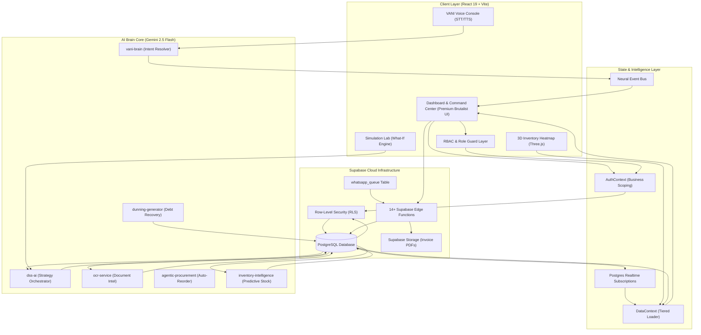

# Vyapari Architecture & System Design Specification
## *Autonomous Intelligence for High-Performance Retail Operations*

> [!IMPORTANT]
> This document serves as the absolute source of truth for the technical architecture, data models, AI pipelines, and design paradigms of the **Vyapari** retail intelligence platform. All future development, refactoring, and integration efforts must strictly conform to the specifications detailed herein.

---

## 1. System Topology & Architectural Overview

Vyapari is a high-performance, multi-tenant retail intelligence platform designed to elevate standard inventory and transaction data into predictive strategic plans. The system is engineered around a decoupled, service-oriented architecture connecting a high-speed Brutalist front-end with a serverless Postgres backend (Supabase) and real-time AI middleware.



---

## 2. Modern Executive Frontend Architecture & Core Stack

The frontend is built on **React 19** and compiled via **Vite**. The UI implements a custom **"Modern Executive" Design System**, utilizing premium typography (Outfit, Space Grotesk), glassmorphic elevations, and a sophisticated indigo-neon palette over a subtle grid-based neural background.

### 2.1 Component Architecture Mapping
All front-end components are modularly isolated inside `src/components`:
- **`3d/InventoryHeatmap.tsx`**: Uses `@react-three/fiber` to render an interactive 3D box heatmap displaying stock volumes and velocity.
- **`VANI/VANI.tsx`**: Floating console capturing user audio, routing text inputs to the `vani-brain` engine.
- **`dashboard/Dashboard.tsx`**: The main "Executive War Room" dashboard, using **Neural Pulse** micro-animations and high-density KPI ribbons.
- **`inventory/ProductInsights.tsx`**: High-fidelity detail view for individual products, showing historical price trends and velocity metrics.
- **`contacts/CustomerDetail.tsx`**: Analytical dashboard for customer behavior, including CLV (Customer Lifetime Value) and RFM scores.
- **`dss/SimulationEngine.tsx`**: The core of the **Simulation Lab**, allowing users to run "What-If" scenarios on pricing and market conditions.
- **`banker/BankerStrategicView.tsx`**: Specialized module for institutional credit readiness, visualizing debt-to-equity and cash flow waterfalls.
- **`common/RoleGuard.tsx`**: Enforces Role-Based Access Control (RBAC) across sensitive modules (e.g., Banker's View restricted to Owners/Bankers).

### 2.2 Styling System (Tailwind CSS 4.0 & Custom CSS)
Vyapari uses **Tailwind CSS 4.0** with deep theme configurations. Theme variables are declared using `@theme` syntax to achieve a premium executive feel:
```css
@theme {
  --color-ink: #0F172A;      /* Deep Slate */
  --color-neon: #9FEF00;     /* Kinetic Neon Lime */
  --color-brand: #4F46E5;    /* Executive Indigo */
  --color-neural: #6366F1;   /* Soft Neural Indigo */
  --color-glass: rgba(255, 255, 255, 0.4);
}
```

---

## 3. State Orchestration & Tiered Loading Strategy

To handle enterprise-grade datasets without UI lag, Vyapari implements a **Dual-Tier Loading Strategy** governed by `DataContext.tsx`.

1. **Priority Tier (Initial Load)**:
   - `products`, `invoices`, `contacts`, `categories`.
2. **Deferred Tier (+5s)**:
   - `ledger_entries`, `audit_logs`, `stock_movements`.

### 3.1 Neural Event Bus
The platform utilizes a custom event-driven architecture where AI-driven insights (e.g., a "Critical Stockout" predicted by the AI) are broadcast via the **Neural Event Bus**. This allows UI components to react to background AI processes without polling.

---

## 4. Normalized Postgres Database Schema

The platform leverages a Postgres schema with Row-Level Security (RLS) to enforce absolute multi-tenant isolation.

### 4.1 Advanced Intelligence Tables
In addition to core tables (`products`, `invoices`), Vyapari utilizes specialized intelligence tables:

- **`rfm_results`**: Stores Recency, Frequency, and Monetary scores for every customer.
- **`inventory_insights`**: AI-generated suggestions for restocking and deadstock liquidation.
- **`automation_rules`**: User-defined and AI-assisted triggers for automated tasks (e.g., "Send WhatsApp when invoice is 3 days overdue").
- **`simulation_history`**: Persists "What-If" scenario results for historical comparison.
- **`whatsapp_queue`**: Manages outgoing automated communications via the `whatsapp-processor` edge function.
- **`vani_logs`**: Analytical logs for voice interactions, used for fine-tuning the intent resolver.

### 4.2 Database Intelligence (PL/pgSQL)
Critical operational logic is offloaded to the database:
- **`search_products_smart`**: A weighted search function prioritizing frequently purchased and high-stock items.
- **`deduct_stock_safe`**: Atomic inventory deduction with transactional safety and ledger synchronization.

---

## 5. Decision Support System (DSS) Core Engines

The **Decision Support System (DSS)** orchestrates multiple mathematical and heuristic models:

1. **Pricing Engine**: Analyzes Price Elasticity ($\epsilon$) to recommend margin optimizations.
2. **RFM Clustering**: Groups customers into segments like `Whales`, `Hibernating`, or `Churn Risk`.
3. **Forecast Engine**: Uses time-series analysis to project cash flow and revenue for the next 30/60/90 days.
4. **Replenishment Engine**: Calculates reorder points based on real-world stock velocity, not just static levels.
5. **Churn Prediction**: Identifies customers likely to stop buying based on transaction interval deviations.
6. **Market Share Simulator**: Runs multinomial logit models to project share against competitors based on brand equity and pricing.

---

## 6. VANI: Voice AI Neural Interface

VANI provides a voice-first command layer, mapping spoken language to platform actions.

1. **Capture**: Browser Web Speech API captures audio.
2. **Resolve**: `vani-brain` (Edge Function + Gemini) resolves intent (e.g., `NAVIGATE`, `QUERY_STOCK`).
3. **Execute**: `vaniExecutor.ts` triggers the frontend action.
4. **Speak**: `SpeechSynthesis` provides audio feedback to the user.

---

## 7. WhatsApp Automation & Dunning Workflow

1. **Trigger**: `automation_rules` detects condition (e.g., invoice overdue by 3 days)
2. **Queue**: A message job is inserted into `whatsapp_queue` table
3. **Generate**: `dunning-generator` (Edge Function + Gemini) creates a personalized recovery message based on customer sentiment
4. **Dispatch**: `whatsapp-processor` Edge Function sends the message and updates delivery status in `whatsapp_queue`
5. **Log**: Result is recorded in `audit_logs` for compliance tracking

---

## 8. OCR & Document Intelligence

The OCR pipeline digitizes physical vendor invoices:
- **Extraction**: `ocr-service` (Gemini 2.5 Flash) extracts line items, tax details, and vendor info.
- **Auto-Learning**: `vendor_ocr_profiles` track corrected fields to improve future extraction accuracy.
- **Integration**: Approved OCR scans automatically update `products` (stock) and `ledger_entries` (credit).

---

## 9. 14+ Specialized AI Edge Functions

Vyapari offloads intensive AI tasks to **Supabase Edge Functions**:
- `agentic-procurement`: Autonomous vendor communication and PO generation.
- `dunning-generator`: Generates polite yet firm debt recovery messages based on customer sentiment.
- `simulation-lab`: Runs massive parallel "What-If" simulations.
- `report-insight`: Generates executive summaries for complex PDF reports.
- `whatsapp-processor`: Manages the queue and delivery status of automated messages.

---

## 10. Security, RBAC & Multi-Tenancy

### 10.1 Row-Level Security (RLS)
Every table is hardened with RLS policies, ensuring `business_id` scoping at the database level. No tenant can ever access data from another tenant.

### 10.2 Role-Based Access Control (RBAC)
The `useRBAC` hook and `RoleGuard` component enforce granular permissions:
- **Owner**: Full access to all modules and settings.
- **Employee**: Can manage invoices and inventory; no access to DSS or Banker's View.
- **Banker**: Read-only access to specialized financial reports and Bankers View.

---

> [!TIP]
> **Developer Note**: Always verify changes against the `master_schema_v10.sql` and run `npm run typecheck` to ensure full alignment with the predictive pipeline.
