# Vyapari Architecture & System Design Specification
## *Autonomous Intelligence for High-Performance Retail Operations*

> [!IMPORTANT]
> This document serves as the absolute source of truth for the technical architecture, data models, AI pipelines, and design paradigms of the **Vyapari** retail intelligence platform. All future development, refactoring, and integration efforts must strictly conform to the specifications detailed herein.

---

## 1. System Topology & Architectural Overview

Vyapari is a high-performance, multi-tenant retail intelligence platform designed to elevate standard inventory and transaction data into predictive strategic plans. The system is engineered around a decoupled, service-oriented architecture connecting a high-speed Brutalist front-end with a serverless Postgres backend (Supabase) and real-time AI middleware.

```mermaid
graph TD
    %% Frontend Client Layer
    subgraph Client ["Client Layer (React 19 + Vite + Tailwind 4)"]
        UI["Dashboard & Command Center (Premium Brutalist UI)"]
        VANI_UI["VANI Voice Console (STT/TTS)"]
        SimLab["Simulation Lab (What-If Engine)"]
        Heatmap["3D Inventory Heatmap (Three.js)"]
        RBAC["RBAC & Role Guard Layer"]
        BiometricShield["BiometricShield (WebAuthn UI)"]
        LiquidInvoiceAction["LiquidInvoiceAction (Early Settlement)"]
        MeshInbox["MeshInbox (Collaborative P2P Sync)"]
        VisualVerification["VisualVerification (vPOD Camera)"]
        SmartDunning["SmartDunning (Sentiment-Aware Recovery)"]
        ITCShield["ITCShield (GST Compliance UI)"]
        FraudGuard["FraudGuard (Margin/Drift Monitoring)"]
        MarketSimulator["MarketSimulator ( Monte Carlo Slider UI )"]
        PaymentPortal["PaymentPortal (Unified Checkout UI)"]
    end

    %% State & Service Orchestration Layer
    subgraph Services ["State & Service Orchestration Layer"]
        Auth["AuthContext (Business Scoping)"]
        Data["DataContext (Tiered Loader)"]
        RT["Postgres Realtime Subscriptions"]
        NeuralBus["Neural Event Bus"]
        biometricService["biometricService.ts (WebAuthn Logic)"]
        settlementEngine["settlementEngine.ts (Liquid Invoice calculations)"]
        meshService["meshService.ts (P2P Handshake & Hybrid Resolution)"]
        procurementService["procurementService.ts (Auto-Replenish Agent)"]
        disputeGuardService["disputeGuardService.ts (Conflict Scorer)"]
        fraudGuardService["fraudGuardService.ts (Margin & Cost Anomaly Monitor)"]
        itcShieldService["itcShieldService.ts (Fuzzy GSTR-2B Matching)"]
        stripeService["stripeService.ts (Stripe Checkout SDK)"]
        razorpayService["razorpayService.ts (Razorpay Checkout SDK)"]
    end

    %% Cloud Infrastructure Layer
    subgraph Cloud ["Supabase Cloud Infrastructure"]
        DB[(PostgreSQL Database)]
        RLS["Row-Level Security (RLS)"]
        Storage["Supabase Storage (Invoice PDFs)"]
        Functions["Supabase Edge Functions (VANI Brain, OCR, WhatsApp, Checkout)"]
        invoice_payment_splits["invoice_payment_splits Table"]
        credit_notes["credit_notes Table"]
        peer_drafts["peer_drafts Table (Extended Dispute Buffer)"]
        invoices["invoices Table (Extended Agency Fields)"]
        settlement_transactions["settlement_transactions Table"]
        gstr2b_records["gstr2b_records Table"]
    end

    %% AI Core Layer
    subgraph AI ["AI Brain Core (Gemini 2.5 Flash / 1.5 Pro / 2.0 Flash)"]
        VaniBrain["vani-brain (Intent Resolver)"]
        DssAI["dss-ai (Strategy Orchestrator)"]
        OcrService["ocr-service (Document Intel)"]
        ProcureAI["agentic-procurement (Auto-Reorder)"]
        InvIntel["inventory-intelligence (Predictive Stock)"]
        DunningGen["dunning-generator (Debt Recovery)"]
        AutoRecon["auto-reconciliation (Payment Matcher)"]
        RiskBlocker["predictive-risk (Credit Guard)"]
    end

    %% Visual Relationships
    UI --> Auth
    Auth --> RLS
    RLS --> DB
    DB --> RLS
    DB --> RT
    RT --> Data
    Data --> UI
    Heatmap --> Data
    DB --> Data
    DB --> DssAI
    DssAI --> DB
    DB --> InvIntel
    InvIntel --> DB
    DB --> AutoRecon
    AutoRecon --> DB
    DB --> RiskBlocker
    RiskBlocker --> UI
    DB --> OcrService
    OcrService --> DB
    DunningGen --> DB
    Functions --> DB
    Functions --> Storage
    
    %% New Service & Component Mappings
    BiometricShield --> biometricService
    biometricService --> DB
    LiquidInvoiceAction --> settlementEngine
    settlementEngine --> invoices
    MeshInbox --> meshService
    meshService --> peer_drafts
    meshService --> credit_notes
    VisualVerification --> DB
    SmartDunning --> Data
    ITCShield --> itcShieldService
    itcShieldService --> DB
    FraudGuard --> fraudGuardService
    fraudGuardService --> DB
    MarketSimulator --> DssAI
    PaymentPortal --> stripeService
    PaymentPortal --> razorpayService
    stripeService --> Functions
    razorpayService --> Functions
    
    %% DB Relations
    invoices --> invoice_payment_splits
    peer_drafts --> credit_notes
    invoices --> settlement_transactions
    gstr2b_records --> invoices
```



---

## 2. Modern Executive Frontend Architecture & Core Stack

The frontend is built on **React 19** and compiled via **Vite**. The UI implements a custom **"Modern Executive" Design System**, utilizing premium typography (Outfit, Space Grotesk), glassmorphic elevations, and a sophisticated indigo-neon palette over a subtle grid-based neural background.

### 2.1 Core Component Architecture Mapping
All front-end components are modularly isolated inside `src/components` and `src/pages`:
- **`3d/InventoryHeatmap.tsx`**: Uses `@react-three/fiber` to render an interactive 3D box heatmap displaying stock volumes and velocity.
- **`VANI/VANI.tsx`**: Floating console capturing user audio, routing text inputs to the VANI processing pipeline.
- **`dashboard/Dashboard.tsx`**: The main "Executive War Room" dashboard, using **Neural Pulse** micro-animations and high-density KPI ribbons.
- **`inventory/ProductInsights.tsx`**: High-fidelity detail view for individual products, showing historical price trends and velocity metrics.
- **`contacts/CustomerDetail.tsx`**: Analytical dashboard for customer behavior, including CLV (Customer Lifetime Value) and RFM scores.
- **`dss/SimulationEngine.tsx`**: The core of the **Simulation Lab**, allowing users to run "What-If" scenarios on pricing and market conditions.
- **`banker/BankerStrategicView.tsx`**: Specialized module for institutional credit readiness, visualizing debt-to-equity and cash flow waterfalls.
- **`common/RoleGuard.tsx`**: Enforces Role-Based Access Control (RBAC) across sensitive modules (e.g., Banker's View restricted to Owners/Bankers).
- **`pages/PaymentPortal.tsx`**: The customer-facing, secure checkout gateway supporting instant UPI QR payments, Stripe credit/debit card processing, and Razorpay regional banking channels.

### 2.2 Advanced Intelligence & Automation Components
- **`auth/BiometricShield.tsx`**: Cryptographic identity verification modal window using hardware-level biometrics (WebAuthn) for sensitive ledger overrides and bankers transactions.
- **`invoices/LiquidInvoiceAction.tsx`**: Generates and broadcasts dynamic early-payment discounts computed via time-decay parameters.
- **`invoices/MeshInbox.tsx`**: Unified incoming peer ledger draft inbox with controls for partial acceptance, credit note generation, and tax escrow hold.
- **`inventory/VisualVerification.tsx`**: Camera scanner station using computer vision (vPOD) to confirm the integrity of incoming deliveries against purchase orders.
- **`automation/SmartDunning.tsx`**: Customer sentiment-aware dunning message lab that auto-drafts optimized recovery reminders for WhatsApp.
- **`compliance/ITCShield.tsx`**: Neural reconciliation dashboard displaying perfect matches, mismatches, and GSTR-2B discrepancy logs.
- **`analytics/FraudGuard.tsx`**: High-visibility active anomaly tracking panel displaying product margins and vendor cost drifts.
- **`analytics/MarketSimulator.tsx`**: Interactive slider board for running what-if scenarios on margins and demand variations.

### 2.3 Styling System (Tailwind CSS 4.0 & Custom CSS)
Vyapari uses **Tailwind CSS 4.0** with deep theme configurations. Theme variables are declared using `@theme` syntax to achieve a premium executive feel:
```css
@theme {
  --color-ink: #0F172A;      /* Deep Slate */
  --color-neon: #9FEF00;     /* Kinetic Neon Lime */
  --color-brand: #4F46E5;    /* Executive Indigo */
  --color-neural: #6366F1;   /* Soft Neural Indigo */
  --color-glass: rgba(255, 255, 255, 0.4);
}
```

---

## 3. State Orchestration & Tiered Loading Strategy

To handle enterprise-grade datasets without UI lag, Vyapari implements a **Dual-Tier Loading Strategy** governed by `DataContext.tsx`.

1. **Priority Tier (Initial Load)**:
   - `products`, `invoices`, `contacts`, `categories`.
2. **Deferred Tier (+5s)**:
   - `ledger_entries`, `audit_logs`, `stock_movements`.

### 3.1 Neural Event Bus
The platform utilizes a custom event-driven architecture where AI-driven insights (e.g., a "Critical Stockout" predicted by the AI) are broadcast via the **Neural Event Bus**. This allows UI components to react to background AI processes without polling.
Standard events include:
- `app:navigate`: Triggers router synchronization across disparate workspaces.
- `app:toast`: Broadcasts smart system-wide AI recommendations.
- `app:inventory-search`: Signals the inventory layout to filter by keyword.
- `app:audit-search`: Triggers targeted compliance audit logs scanning.

---

## 4. Normalized Postgres Database Schema & Migration Layers

The platform leverages a Postgres schema with Row-Level Security (RLS) to enforce absolute multi-tenant isolation. Recent migrations extend the database to support advanced B2B coordination, dispute settlement, and compliance.

### 4.1 Core Schema Additions
- **`invoice_payment_splits`**: Stores micro-installment records generated when `split_installments` is selected as the preferred settlement path.
- **`credit_notes`**: Records ledger credit balances generated from partial peer draft acceptances to offset future B2B trade debts.
- **`gstr2b_records`**: Captures GSTR-2B compliance data imported from the tax portal for neural reconciliation matching.
- **`settlement_transactions`**: Logs the details of dynamic early settlement offers, including baseline limits, active discounts, and expiry metrics.
- **`peer_drafts`**: Buffers incoming collaborative peer ledger transactions before formal book integration.
- **`vani_logs`**: Logs voice command activity parameters (transcript, intent, confidence, execution status) to audit companion performance.

### 4.2 Invoice Table Extension Fields
- `preferred_settlement` (`settlement_path` ENUM: `standard`, `liquid_discount`, `factored_bank`, `split_installments`, `debt_endorsement`).
- `factoring_partner_id`: UUID reference for banks funding receivables.
- `installment_intervals`: Number of split payment intervals (defaults to 1).
- `endorsed_to_business_id`: UUID reference of the supplier receiving an endorsed invoice.
- `risk_markup_percentage` & `risk_premium_amount`: Strategic markups calculated from dispute risks.
- `secure_escrow_hold`: Boolean indicating that the tax portion is held back.
- `itc_status` (`itc_compliance_status` ENUM: `unverified`, `matched`, `mismatched`, `held_escrow`).
- `tax_escrow_held_amount` & `gstr_2b_matching_id`.
- `digital_fingerprint`: SHA-256 validation code matching ledger parity.
- `active_offer`: JSON field capturing active dynamic payment discount offers.

### 4.3 Database Intelligence (PL/pgSQL triggers)
- **`auto_generate_payment_splits()`**: An active table trigger executing after insertions or updates on `invoices`. If `split_installments` is selected with intervals greater than 1, it automatically creates weekly micro-installment records:
```sql
CREATE OR REPLACE FUNCTION auto_generate_payment_splits()
RETURNS TRIGGER AS $$
DECLARE
    v_split_amount NUMERIC;
    v_counter INTEGER := 1;
    v_due_date TIMESTAMP WITH TIME ZONE;
END;
$$ LANGUAGE plpgsql;
```
*(Triggers parse installment bounds, auto-apportion remaining amounts, clean up historical splits, and populate the installments table).*

- **`apply_liquid_settlement()`**: Safely processes early payment discounts, locking rows with `FOR UPDATE`, computing pressure coefficients based on business health metrics, adjusting invoice totals, and writing records to audit ledgers.

---

## 5. Decision Support System (DSS) Core Engines

The **Decision Support System (DSS)** orchestrates multiple mathematical and heuristic models:

1. **Pricing Engine**: Analyzes Price Elasticity ($\epsilon$) to recommend margin optimizations.
2. **RFM Clustering**: Groups customers into segments like `Whales`, `At-Risk`, or `Churn Risk`.
3. **Forecast Engine**: Uses time-series analysis to project cash flow and revenue for the next 30/60/90 days.
4. **Replenishment Engine**: Calculates reorder points based on real-world stock velocity, not just static levels.
5. **Churn Prediction**: Identifies customers likely to stop buying based on transaction interval deviations.
6. **Market Share Simulator**: Runs multinomial logit models to project share against competitors based on brand equity and pricing.

---

## 6. Mathematical Specification of Core AI Modules

Vyapari's intelligence layers are backed by formal mathematical structures. The logic of these models is fully reflected across active codebases:

### 6.1 The Liquid Invoice Engine (Dynamic Early Payment Discount)
The discount percentage ($\delta_t$) offered on an invoice scales with the remaining days until the due date ($T_{rem} = T_{due} - t_{settle}$) and the customer's credit trust rating.
$$\delta_t = \max\left(\delta_{min}, \min\left(\delta_{max}, \delta_{base} + (T_{rem} \times 0.05) - (\text{TrustBonus} \times 0.2)\right)\right)$$
Where:
- $\delta_{base} = 1.0\%$
- $\delta_{min} = 0.5\%$
- $\delta_{max} = 5.0\%$
- $\text{TrustBonus} = \max\left(0, \min\left(1, \frac{\text{CreditScore} - 600}{300}\right)\right)$ (evaluated from customer credit profiles, scaling between 0 and 1).

### 6.2 Predictive Dispute Guard (Conflict Risk Scoring)
Evaluates the probability of a dispute arising from credit sales:
$$P(\text{Dispute}) = \min(RiskScore, 95)$$
Where $RiskScore$ is computed by a multi-factor checks:
$$RiskScore = OverdueFactor(40) + HighValueFactor(25) + NewCustomerFactor(15)$$
- **Overdue Factor**: Add $40$ risk points if the customer's active overdue invoice count > 3.
- **High Value Factor**: Add $25$ risk points if invoice items contain individual unit values > ₹50,000.
- **New Customer Factor**: Add $15$ risk points if the customer's invoice history length <= 1.

### 6.3 Neural Fraud Guard & Margin Protection
1. **Margin Erosion Check**: Warns or halts transactions depending on bleeding margins:
$$\text{Margin}\% = \frac{S_p - C_p}{S_p} \times 100$$
Warnings are raised if $\text{Margin}\% < 10\%$. Critical alerts are flagged if margins go negative, signaling direct asset bleeding.
2. **Vendor Price Drift Check (Z-Score)**: Analyzes incoming vendor prices against a sliding history window of size $N$ (where $N \ge 3$, typically $N = 10$) using statistical standard deviations:
$$\mu_{cost} = \frac{1}{N}\sum_{i=1}^N C_i$$
$$\sigma = \sqrt{\frac{1}{N}\sum_{i=1}^N (C_i - \mu_{cost})^2}$$
$$Z = \frac{C_{new} - \mu_{cost}}{\sigma}$$
If $Z > 2.0$ and the absolute drift percentage exceeds $5\%$, a warning is dispatched for price inflation:
$$\text{Drift}\% = \frac{C_{new} - \mu_{cost}}{\mu_{cost}} \times 100$$
3. **Invoice Fraud Risk Scoring**: Real-time validation checking:
$$RiskScore = DuplicateInvoice(85) + VelocityRisk(40) + OutlierRisk(30) + RoundNumberRisk(15)$$
Where:
- *DuplicateInvoice*: Coded as $85$ if an invoice has the same invoice number and supplier ID as an existing record.
- *VelocityRisk*: Coded as $40$ if more than 5 invoices are logged for the same contact within 24 hours.
- *OutlierRisk*: Coded as $30$ if the total invoice value exceeds ₹250,000.
- *RoundNumberRisk*: Coded as $15$ if the amount exceeds ₹50,000 and is an exact multiple of ₹10,000.
- The total score is capped: $RiskScore_{final} = \min(RiskScore, 100)$.

### 6.4 Neural GSTR-2B Matching (ITC Shield)
Leverages a dual-pass matching score based on fuzzy billing comparisons:
$$MatchScore = 0.7 \times FuzzyScore(Inv_{books}, Inv_{portal}) + 0.3 \times AmtScore(Amt_{books}, Amt_{portal})$$
Where:
- $FuzzyScore$ uses Levenshtein distance:
$$FuzzyScore(s_1, s_2) = 1 - \frac{\text{Levenshtein}(s_1, s_2)}{\max(|s_1|, |s_2|)}$$
- $AmtScore$ evaluates the taxable difference:
$$AmtScore = \begin{cases} 1.0, & \text{if } |Amt_1 - Amt_2| < 1 \\ 0.9, & \text{if } 1 \le |Amt_1 - Amt_2| < 10 \\ 0.0, & \text{otherwise} \end{cases}$$
Reconciliations with $MatchScore > 0.95$ are marked `matched`. Scores between $0.60$ and $0.95$ are marked `mismatched` for manual resolution, and others are classified `missing_in_books`.

---

## 7. Collaborative Peer-to-Peer Synchronization ("The Mesh")

"The Mesh" is Vyapari’s zero-entry transaction channel. Rather than forcing manual data transcription when goods are exchanged, invoices are securely transmitted between peer tenants.

```
+------------------+                   +------------------+
|    Business A    |                   |    Business B    |
| (Sales Invoice)  |                   | (Purchase Draft) |
+--------+---------+                   +--------+---------+
          |                                      ^
          |  1. Generate SHA-256 Fingerprint     |
          +--------------------------------------+
          |  2. Insert to isolated peer_drafts  |
          +--------------------------------------+
          |  3. Realtime WebSocket Broadcast     |
          +--------------------------------------+
          |                                      |
          |                                      |  4. Hybrid Acceptance Choice
          |                                      +-------------------------------+
          |                                      |  - Deduct Credit Note (Opt A) |
          |                                      |  - Hold Tax Escrow    (Opt B) |
          |                                      +-------------------------------+
          |                                      |
          |<------- 5. Update Status 'accepted'--+
          |
+--------v---------+                   +--------v---------+
|  Active Ledger   |                   |  Purchase Entry  |
|  Status: Paid    |                   |  Status: Draft   |
+------------------+                   +------------------+
```

### 7.1 Hybrid Dispute Resolutions
If peer billing mismatches occur, the receiving business is presented with **Layered Dispute Options** inside the collaborative console:
- **Option A (Partial Acceptance & Credit Note)**: Buyer accepts a subset of the transaction. A local purchase is entered for the adjusted amount, while the ledger automatically issues an approved `credit_note` to Business A for the difference.
- **Option B (Tax Escrow Hold)**: Holds the tax portion (e.g., $18\%$ GST) of the invoice in a secure compliance escrow ledger. Once GSTR-2B compliance is matched, the tax portion is released.

---

## 8. WebAuthn Hardware Cryptographic Biometric Protection

Traditional password authentication is vulnerable to sharing and phishing. Vyapari enforces a **Zero-Trust Biometric Shield** for high-risk actions (e.g., ledger overrides, transaction deletions, access to Banker views).

1. **Ceremony Challenge**: The server issues a randomized cryptographic challenge scoped to the profile's credential boundaries.
2. **Device Attestation**: The browser initiates `navigator.credentials.create` or `navigator.credentials.get` using FaceID, TouchID, or Windows Hello.
3. **Public-Key Validation**: The device returns a public key, credential ID, and signature. Upon server verification, `biometric_enabled` is set to true and the public key is saved securely inside the database (`profiles` table).
4. **Shield Protection**: Success triggers `onSuccess()` callbacks to release UI blocks, bypassing standard password constraints with iron-clad hardware protection.

---

## 9. Visual Proof-of-Delivery (vPOD) & Replenishment Automation

Vyapari connects physical logistics with digital ledgers using advanced image processing.

### 9.1 vPOD Pipeline
1. **Visual Scan**: Courier uploads a photo of the delivered goods and signed invoice at the station.
2. **Vision Analysis**: Gemini 2.5 Flash processes the image to check item counts and match structural signatures.
3. **Ledger Update**: Successful verification automatically sets invoice status to `delivered`, releases pending payments, updates stock quantities, and broadcasts a WhatsApp notification.

### 9.2 Smart Auto-Replenishment (Procurement Agent)
The procurement layer checks inventory levels against custom reorder lines. If stock is low:
- **Grouping**: Items are bundled by supplier in memory.
- **PO Generation**: Autonomously inserts records to `purchase_orders` and `purchase_order_items`.
- **Dispatching**: Invokes the `whatsapp-processor` Edge Function to send structured procurement notifications directly to supplier phone numbers.
- **Fallback**: Opens a direct WhatsApp API redirection window (`https://wa.me/{phone}?text={message}`) if direct server-side hooks fail.

---

## 10. Granular Multi-Tenancy & Database Security

Data isolation is guaranteed directly inside the PostgreSQL database using **Row-Level Security (RLS)**.

### 10.1 Table Scoping Policies
- **`products`**: Scoped by `business_id` using `auth.uid()`.
- **`invoices`**: Scoped to the sender or target business ID:
```sql
CREATE POLICY invoices_peer_isolation ON invoices
    FOR ALL
    USING (business_id = auth.uid() OR target_business_id = auth.uid())
    WITH CHECK (business_id = auth.uid());
```
- **`peer_drafts`**: Accessible strictly to participating sender or target tenants.
- **`invoice_payment_splits`** & **`credit_notes`**: Scoped to corresponding invoice relationships.

---

## 11. Payment Gateway Architecture & Checkout Infrastructure

Vyapari features a production-ready, dual-gateway payment integration layer connected directly to customer-facing checkout views and auto-reconciliation ledgers.

```
                  +--------------------------------+
                  |  Customer opens Invoice Link   |
                  +---------------+----------------+
                                  |
                                  v
                  +---------------+----------------+
                  |      PaymentPortal (/pay)      |
                  +---------------+----------------+
                                  |
            +---------------------+---------------------+
            |                     |                     |
            v                     v                     v
    +-------+-------+     +-------+-------+     +-------+-------+
    |   Stripe Checkout   |  |  Razorpay Checkout |  |   UPI QR Code   |
    +-------+-------+     +-------+-------+     +-------+-------+
            |                     |                     |
            | (Load V3 SDK)       | (Load v1 SDK)       | (upi:// protocol)
            v                     v                     v
    +-------+-------+     +-------+-------+     +-------+-------+
    | Create Session|     |  Create Order |     |  Scan QR Code |
    | Edge Function |     |  Edge Function|     |  & Pay App    |
    +-------+-------+     +-------+-------+     +-------+-------+
            |                     |                     |
            v                     v                     v
    +-------+-------+     +-------+-------+     +-------+-------+
    | Redirect to   |     | Open Popup    |     | Trigger Auto  |
    | stripe.com    |     | Checkout      |     | DB Mutation   |
    +-------+-------+     +-------+-------+     +-------+-------+
            |                     |                     |
            +---------------------+---------------------+
                                  |
                                  v
                  +---------------+----------------+
                  |  Update Invoice Status: Paid   |
                  +--------------------------------+
```

### 11.1 Dynamic Stripe Checkout Flow
- **SDK Dynamically Loaded**: The browser loads the Stripe.js script `https://js.stripe.com/v3/` only on invocation, maximizing performance.
- **Edge Session Handshake**: The client invokes the `stripe-checkout` Supabase Edge Function with metadata detailing the target `invoiceId` and `amount`.
- **API Isolation**: The Edge Function acts as a secure proxy. It initiates a session with the Stripe API using secret server keys, returning a secure checkout URL.
- **Redirect & Completion**: The client redirects to the hosted Stripe page. On completion, the customer returns to the portals `/pay?status=success&session_id=...`, which automatically updates the invoice status to `paid`.

### 11.2 Razorpay Integration
- **SDK Dynamically Loaded**: Loads the Razorpay checkout script `https://checkout.razorpay.com/v1/checkout.js` dynamically.
- **Order Generation**: Invokes the `razorpay-checkout` Edge Function to obtain a real order ID, preventing key tampering and ensuring exact pricing parity.
- **Checkout Modal**: Opens the official Razorpay Checkout popup over the active browser thread.
- **Instant Mutation Handler**: Successful payment triggers a secure callback hook that immediately updates the `status` column to `paid` inside the database, bypassing redirection delays.

### 11.3 Instant UPI QR Payments
- **Dynamic QR Code**: Generates a standard UPI URL schema `upi://pay?pa={upiId}&pn={businessName}&am={amount}&tn={invoiceRef}`.
- **Rendering**: Converts this schema into a clean, client-side QR code block.
- **UPI Deep Link**: Customers on mobile devices can tap the payment option to launch any installed UPI app (GPay, PhonePe, Paytm).
- **UPI Simulation**: Offers developers a mock success path that updates status instantly in development environments to check ledger alignment.

---

## 12. VANI Voice Intelligence & NLP Pipeline

**V.A.N.I.** (Voice Activated Network Intelligence) acts as the operational commander of Vyapari, offering zero-latency voice recognition and proactive business insights.

### 12.1 Language & Parser Calibrations
- **Multilingual Support**: Calibrated to parse inputs across standard English, Hinglish, Hindi, Marathi, Tamil, Telugu, Gujarati, Kannada, and Bengali.
- **Dual-Pass Intent Execution**:
  1. **Direct Regex/Fuzzy Matching**: Evaluates keywords (e.g., *bills*, *mal satha*, *khata*) locally using pre-configured dictionaries. This enables zero-latency responses for navigation intents.
  2. **Direct Gemini Cloud Engine**: If fuzzy matches fall below confidence limits, it dispatches the query to a Gemini model using the system prompt:
```
You are V.A.N.I. (Voice Activated Network Intelligence) — modeled after J.A.R.V.I.S...
Analyze the JSON Context Data and user transcript to return a structured JSON response containing intent and params.
```

### 12.2 Active Intent & State Mapping
Intents are mapped to actions via `vaniExecutor.ts`:
- `NAVIGATE`: Fires global `app:navigate` events to load dashboards or pages.
- `CREATE_INVOICE`: Matches input parameters against the contacts database and pre-fills transaction drawers.
- `CHECK_STOCK`: Redirects the inventory workspace to search for matching stock profiles.
- `STRATEGIC_PLAN`: Compiles cash-flow parameters and loads predictions.
- `SEND_REMINDER`: Inserts alerts into `reminders` and dispatches WhatsApp messages.
- `AUTONOMOUS_REORDER`: Activates the procurement agent to compile reorder sheets.

---

## 13. Universal Reporting Engine & Document Generation

Vyapari employs a robust, client-side document generation and export system designed to standardize reporting across all modules (invoices, inventory, analytics, compliance, etc.). The reporting architecture enforces branded, context-aware filenames and standardizes output formats.

### 13.1 Document Generation Handlers
- **`generatePDFReport` (jsPDF & jspdf-autotable)**: Programmatically constructs branded PDF documents complete with multi-page footers, dynamic tables, and custom CSS color variables mapped to the executive design system.
- **`generateXLSXReport` (SheetJS)**: Compiles complex, multi-sheet Excel workbooks with frozen header rows, automated column width calculations, and structured summary data.
- **`generateCSVReport`**: Safely escapes string data and constructs UTF-8 encoded, BOM-prefixed CSV files, guaranteeing flawless compatibility with enterprise spreadsheet software.

### 13.2 Intelligent File Naming Convention
A strict metadata-driven naming system handles all file designations. The central `downloadReport.ts` controller maps report types to uniform file definitions:
- Examples: 
  - `INV-{invoice_number}_{contact_name}_{YYYY-MM-DD}.pdf`
  - `Vyapari_Inventory_{business_name}_{YYYY-MM-DD}.xlsx`
  - `Vyapari_AuditLog_{business_name}_{YYYY-MM-DD}.csv`

### 13.3 Supabase Storage UUID Resolution
The engine natively corrects legacy workflows where Supabase Storage saved objects using bare UUIDs (e.g., `3796d1c8-a862-4fd9-b194-f5bd344b14a3`).
- **Upload Interception (`uploadReport.ts`)**: Forces explicit storage paths matching the dynamic naming convention.
- **Download Transformation (`downloadFromSupabase`)**: Automatically intercepts UUID-formatted file blobs from Supabase Storage and re-casts them with standard `.pdf` or `.xlsx` extensions before downloading.

---

> [!TIP]
> **Developer Audit Checklist**: Always run `npm run typecheck` after schema adjustments to ensure full TypeScript alignment across predictive analytics and active components.
